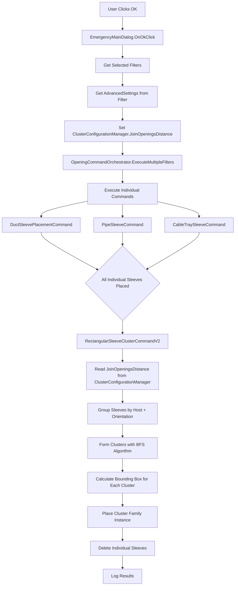

# CLUSTER SLEEVE ORCHESTRATION ARCHITECTURE

## 📋 Overview

This document defines how the **Cluster Sleeve Command** (`RectangularSleeveClusterCommandV2`) is orchestrated after individual sleeve placement, ensuring proper configuration handling and optimal performance.

---

## 🎯 Purpose

**Cluster sleeve placement** merges multiple closely-spaced individual sleeves into single rectangular openings to:
1. **Reduce wall weakening** from multiple penetrations
2. **Simplify construction** with fewer openings
3. **Optimize structural integrity** by consolidating loads

---

## 🔧 Key Configuration Setting

### **Critical User Input: `JoinOpeningsDistance`**

**Location:** `Models/SettingsModel.cs` → Line 32

```csharp
public double JoinOpeningsDistance { get; set; } = 200.0;
```

**Purpose:** Defines the **edge-to-edge distance threshold** (in millimeters) for clustering sleeves.

| Setting Value | Behavior |
|--------------|----------|
| **100mm** (tight) | Only very close sleeves cluster → More individual sleeves |
| **200mm** (default) | Moderate clustering → Balanced approach |
| **300mm** (loose) | Aggressive clustering → Fewer, larger openings |

**Impact on Performance:**
- ✅ **Smaller value** (100mm): Faster clustering, fewer comparisons
- ⚠️ **Larger value** (300mm): Slower clustering, more comparisons (O(n²) algorithm)

---

## 📐 Cluster Sleeve Logic (Current Implementation)

### From: `Commands/RectangularSleeveClusterCommandV2.cs`

**Line 56:**
```csharp
double toleranceDist = UnitUtils.ConvertToInternalUnits(100.0, UnitTypeId.Millimeters);
```

**🚨 ISSUE: Hardcoded to 100mm!**

The current implementation **does NOT use** `SettingsModel.JoinOpeningsDistance`.

---

## 🏗️ Cluster Sleeve Algorithm

### 1. **Sleeve Collection** (Lines 59-88)
```csharp
var rawSleeves = new FilteredElementCollector(doc)
    .OfClass(typeof(FamilyInstance))
    .Cast<FamilyInstance>()
    .Where(fi => fi.Symbol.Family.Name.EndsWith("OpeningOnWall", StringComparison.OrdinalIgnoreCase)
              || fi.Symbol.Family.Name.EndsWith("OpeningOnSlab", StringComparison.OrdinalIgnoreCase))
    .ToList();

// Filter by section box (optimizes for visible area only)
var sleeves = SectionBoxHelper.FilterElementsBySectionBox(uiDoc, rawElements);
```

**Key Points:**
- Collects ALL placed individual sleeves (Duct, Pipe, CableTray)
- Filters by active section box to reduce processing scope
- Includes both wall and slab openings

### 2. **Grouping by Host & Orientation** (Lines 97-130)
```csharp
var sleeveGroups = sleeves.GroupBy(sleeve => {
    var hostOrientationParam = sleeve.LookupParameter("HostOrientation");
    string effectiveOrientation = hostOrientationParam != null ? hostOrientationParam.AsString() : "";
    
    var systemTypeParam = sleeve.LookupParameter("SystemType");
    string systemType = systemTypeParam != null ? systemTypeParam.AsString() : "";
    
    return new SleeveGroupKey("Wall/Slab", systemType, effectiveOrientation);
});
```

**Groups sleeves by:**
- **Host Type**: Wall, Slab, Framing
- **Orientation**: X-axis, Y-axis (for walls/framing)
- **System Type**: Duct, Pipe, CableTray

**Why?** Sleeves with different orientations cannot cluster (structural incompatibility).

### 3. **Edge-to-Edge Clustering** (Lines 213-277)

**Algorithm: Breadth-First Search (BFS)**

```csharp
// For each unprocessed sleeve:
while (unprocessedSleeveIds.Count > 0)
{
    var cluster = new List<int>();
    var queue = new Queue<int>();
    
    // Start new cluster
    int seedId = unprocessedSleeveIds.First();
    queue.Enqueue(seedId);
    
    // Find all neighbors within tolerance
    while (queue.Count > 0)
    {
        int currentId = queue.Dequeue();
        cluster.Add(currentId);
        
        // Check all unprocessed sleeves for proximity
        foreach (var candidateId in unprocessedSleeveIds)
        {
            double edgeDistance = CalculateEdgeToEdgeDistance(current, candidate);
            
            if (edgeDistance <= toleranceDist) // 🚨 Uses hardcoded 100mm
            {
                queue.Enqueue(candidateId);
            }
        }
    }
    
    if (cluster.Count >= 2) // Only cluster if 2+ sleeves
    {
        clusters.Add(cluster);
    }
}
```

**Performance:**
- **Best Case:** O(n) if no clusters
- **Worst Case:** O(n²) if all sleeves cluster
- **Typical:** O(n·k) where k = average cluster size

### 4. **Cluster Family Selection** (Lines 340-368)

```csharp
string clusterFamilyName;
if (familyName.Contains("OpeningOnWall", StringComparison.OrdinalIgnoreCase))
{
    if (effectiveOrientation == "X")
        clusterFamilyName = "ClusterOpeningOnWallX";
    else if (effectiveOrientation == "Y")
        clusterFamilyName = "ClusterOpeningOnWallY";
    else
        clusterFamilyName = "ClusterOpeningOnWallRect"; // Fallback
}
else if (familyName.Contains("OpeningOnSlab", StringComparison.OrdinalIgnoreCase))
{
    clusterFamilyName = "ClusterOpeningOnSlab";
}
```

**Family Mapping:**

| Individual Sleeve | Cluster Family | Notes |
|------------------|----------------|-------|
| `DuctOpeningOnWall` + X-axis | `ClusterOpeningOnWallX` | Wall normal = Y-axis |
| `DuctOpeningOnWall` + Y-axis | `ClusterOpeningOnWallY` | Wall normal = X-axis |
| `DuctOpeningOnSlab` | `ClusterOpeningOnSlab` | Horizontal floors |
| `PipeOpeningOnWall` + X-axis | `ClusterOpeningOnWallX` | Same logic |
| `CableTrayOpeningOnWall` + X-axis | `ClusterOpeningOnWallX` | Same logic |

### 5. **Bounding Box Calculation** (Lines 283-313)

```csharp
// Calculate cluster extents
double minX = double.MaxValue;
double maxX = double.MinValue;
double minY = double.MaxValue;
double maxY = double.MinValue;
double sumZ = 0.0;

foreach (var sleeve in clusterSleeves)
{
    XYZ center = (sleeve.Location as LocationPoint)?.Point ?? XYZ.Zero;
    double width = GetParameterValue(sleeve, "Width");
    double height = GetParameterValue(sleeve, "Height");
    
    minX = Math.Min(minX, center.X - width / 2.0);
    maxX = Math.Max(maxX, center.X + width / 2.0);
    minY = Math.Min(minY, center.Y - height / 2.0);
    maxY = Math.Max(maxY, center.Y + height / 2.0);
    sumZ += center.Z;
}

// Cluster center and size
XYZ clusterCenter = new XYZ((minX + maxX) / 2.0, (minY + maxY) / 2.0, sumZ / clusterSleeves.Count);
double clusterWidth = maxX - minX;
double clusterHeight = maxY - minY;
```

### 6. **Duplicate Suppression** (Lines 376-409)

```csharp
// Check if cluster already exists at this location
bool duplicateExists = existingClusters.Any(ec =>
{
    XYZ ecLoc = (ec.Location as LocationPoint)?.Point;
    double dist = ecLoc?.DistanceTo(clusterCenter) ?? double.MaxValue;
    
    return dist < 0.01 && // Within 10mm
           Math.Abs(GetParameterValue(ec, "Width") - clusterWidth) < 0.01 &&
           Math.Abs(GetParameterValue(ec, "Height") - clusterHeight) < 0.01;
});

if (duplicateExists)
{
    DebugLogger.Log($"[Cluster] Duplicate cluster already exists at {clusterCenter} - skipping");
    continue;
}
```

### 7. **Placement & Deletion** (Lines 411-446)

```csharp
// Place cluster family instance
var clusterInstance = doc.Create.NewFamilyInstance(
    clusterCenter, 
    clusterSymbol, 
    hostElement, 
    structuralType);

// Set parameters
SetParameterValue(clusterInstance, "Width", clusterWidth);
SetParameterValue(clusterInstance, "Height", clusterHeight);
SetParameterValue(clusterInstance, "HostOrientation", effectiveOrientation);
SetParameterValue(clusterInstance, "SystemType", systemType);

placedCount++;

// Delete individual sleeves in this cluster
foreach (var sleeve in clusterSleeves)
{
    doc.Delete(sleeve.Id);
    deletedCount++;
}
```

---

## 🔄 Orchestration Flow

### Current Flow: `Commands/OpeningsPLaceCommand.cs` (Lines 102-119)

```csharp
// 1. Place individual duct sleeves
DebugLogger.Log("Starting duct sleeve placement...");
PlaceDuctSleeves(commandData, doc);

// 2. Place individual damper sleeves
DebugLogger.Log("Starting damper sleeve placement...");
PlaceDamperSleeves(commandData, doc);

// 3. Place individual cable tray sleeves
DebugLogger.Log("Starting cable tray sleeve placement...");
PlaceCableTraySleeves(commandData, doc);

// 4. Place individual pipe sleeves
DebugLogger.Log("Starting pipe sleeve placement...");
PlacePipeSleeves(commandData, doc);

// 5. Convert circular pipes to rectangular (if needed)
DebugLogger.Log("Starting rectangular pipe clustering...");
PlaceRectangularPipeOpenings(commandData, doc);

// 6. ⚠️ CLUSTER ALL RECTANGULAR SLEEVES
DebugLogger.Log("Starting rectangular sleeve clustering...");
PlaceRectangularSleeveClusterV2(commandData, doc);
```

**Key Points:**
1. ✅ Cluster command runs **AFTER** all individual sleeves are placed
2. ✅ Operates on **ALL** rectangular sleeves (Duct, Pipe, CableTray)
3. ⚠️ Uses **hardcoded 100mm tolerance** (not user setting)

---

## 🚨 Required Changes

### 1. **Pass `JoinOpeningsDistance` to Cluster Command**

**Current:**
```csharp
// In RectangularSleeveClusterCommandV2.cs line 56
double toleranceDist = UnitUtils.ConvertToInternalUnits(100.0, UnitTypeId.Millimeters);
```

**Should Be:**
```csharp
// Get from SettingsModel
double toleranceMm = settingsModel.JoinOpeningsDistance;
double toleranceDist = UnitUtils.ConvertToInternalUnits(toleranceMm, UnitTypeId.Millimeters);
```

### 2. **Modify `RectangularSleeveClusterCommandV2` Constructor**

**Add parameter:**
```csharp
public Result Execute(
    ExternalCommandData commandData, 
    ref string message, 
    ElementSet elements,
    SettingsModel settings = null) // NEW PARAMETER
{
    // Use settings if provided, otherwise use default
    double toleranceMm = settings?.JoinOpeningsDistance ?? 100.0;
    double toleranceDist = UnitUtils.ConvertToInternalUnits(toleranceMm, UnitTypeId.Millimeters);
    
    DebugLogger.Log($"[ClusterCommand] Using tolerance: {toleranceMm}mm ({toleranceDist} feet)");
    
    // Rest of existing logic...
}
```

**⚠️ Problem:** `IExternalCommand` interface doesn't support custom parameters!

### 3. **Solution: Use Static Configuration Manager**

**Create:** `Services/ClusterConfigurationManager.cs`

```csharp
namespace JSE_RevitAddin_MEP_OPENINGS.Services
{
    /// <summary>
    /// Singleton to pass configuration settings to cluster command
    /// </summary>
    public class ClusterConfigurationManager
    {
        private static ClusterConfigurationManager _instance;
        private static readonly object _lock = new object();
        
        public double JoinOpeningsDistance { get; set; } = 100.0; // Default 100mm
        
        public static ClusterConfigurationManager Instance
        {
            get
            {
                if (_instance == null)
                {
                    lock (_lock)
                    {
                        if (_instance == null)
                        {
                            _instance = new ClusterConfigurationManager();
                        }
                    }
                }
                return _instance;
            }
        }
        
        public void SetJoinOpeningsDistance(double distanceMm)
        {
            JoinOpeningsDistance = distanceMm;
            DebugLogger.Info($"[ClusterConfig] JoinOpeningsDistance set to: {distanceMm}mm");
        }
        
        public double GetJoinOpeningsDistanceInFeet()
        {
            return UnitUtils.ConvertToInternalUnits(JoinOpeningsDistance, UnitTypeId.Millimeters);
        }
    }
}
```

### 4. **Update Orchestrator to Set Configuration**

**In:** `Services/OpeningCommandOrchestrator.cs`

```csharp
public void ExecuteMultipleFilters(List<OpeningFilter> filters, bool showProgress = true)
{
    // BEFORE executing any commands, set cluster configuration
    var firstFilter = filters.FirstOrDefault();
    if (firstFilter?.OpeningSettings?.AdvancedSettings != null)
    {
        double joinDistance = firstFilter.OpeningSettings.AdvancedSettings.JoinOpeningsDistance;
        ClusterConfigurationManager.Instance.SetJoinOpeningsDistance(joinDistance);
        
        DebugLogger.Info($"[ORCHESTRATOR] Set cluster tolerance to: {joinDistance}mm");
    }
    
    // Continue with existing orchestration logic...
    foreach (var filter in filters)
    {
        // ... execute individual commands
        // ... then cluster command reads from ClusterConfigurationManager.Instance
    }
}
```

### 5. **Update Cluster Command to Use Configuration**

**In:** `Commands/RectangularSleeveClusterCommandV2.cs` (Line 56)

```csharp
// OLD:
// double toleranceDist = UnitUtils.ConvertToInternalUnits(100.0, UnitTypeId.Millimeters);

// NEW:
double toleranceMm = ClusterConfigurationManager.Instance.JoinOpeningsDistance;
double toleranceDist = UnitUtils.ConvertToInternalUnits(toleranceMm, UnitTypeId.Millimeters);

DebugLogger.Log($"[RectangularCluster] Using JoinOpeningsDistance: {toleranceMm}mm (from configuration)");
DebugLogger.Log($"[RectangularCluster] Internal units: {toleranceDist} feet");
```

---

## 🔄 Updated Orchestration Flow



---

## 📊 Performance Considerations

### Cluster Algorithm Complexity

| Operation | Complexity | Notes |
|-----------|-----------|-------|
| **Sleeve Collection** | O(n) | Filtered by section box |
| **Grouping** | O(n) | Single pass |
| **Clustering (BFS)** | O(n·k) | k = avg cluster size |
| **Edge Distance Calc** | O(n²) worst case | Only within same group |
| **Duplicate Check** | O(c·m) | c = clusters, m = existing |
| **Placement** | O(c) | One transaction for all |

**Total:** O(n²) in worst case (all sleeves in one group, one cluster)

### Performance Optimization Tips

1. ✅ **Section Box Filtering**: Reduces `n` significantly
   - Only process visible elements
   - User controls scope

2. ✅ **Grouping by Host/Orientation**: Reduces comparisons
   - Prevents cross-group clustering (invalid anyway)
   - Each group clusters independently

3. ✅ **Early Exit**: Skip if `sleeveCount < 2`
   - No point clustering single sleeve

4. ⚠️ **JoinOpeningsDistance Impact**:
   - **100mm**: Fewer comparisons, tighter clusters
   - **300mm**: More comparisons, looser clusters
   - **Recommendation**: Keep default at 200mm

---

## 🎛️ User Configuration Flow

### Where User Sets `JoinOpeningsDistance`

**Option 1: Main UI (EmergencyMainDialog)**

Currently NOT exposed in UI. Add to "Advanced Settings" section:

```csharp
// Add to EmergencyMainDialog.cs
private TextBox joinOpeningsDistanceTextBox;

private void InitializeAdvancedSettings()
{
    var label = new Label { Text = "Cluster Tolerance (mm):", Location = new Point(10, 200) };
    joinOpeningsDistanceTextBox = new TextBox 
    { 
        Location = new Point(150, 200), 
        Width = 80,
        Text = "200" // Default
    };
    
    // Add tooltip
    var tooltip = new ToolTip();
    tooltip.SetToolTip(joinOpeningsDistanceTextBox, 
        "Distance (mm) to merge sleeves into cluster openings.\n" +
        "Smaller = tighter clustering, Larger = more aggressive merging.");
}

private void SaveAdvancedSettings(OpeningFilter filter)
{
    double joinDistance = double.Parse(joinOpeningsDistanceTextBox.Text);
    filter.OpeningSettings.AdvancedSettings.JoinOpeningsDistance = joinDistance;
}
```

**Option 2: XML Configuration**

Already stored in `SettingsModel` → included in filter XML automatically.

---

## ✅ Implementation Checklist

### Phase 1: Configuration Manager
- [ ] Create `Services/ClusterConfigurationManager.cs`
- [ ] Add singleton pattern with thread safety
- [ ] Add `JoinOpeningsDistance` property
- [ ] Add conversion method to internal units

### Phase 2: Orchestrator Integration
- [ ] Update `OpeningCommandOrchestrator.ExecuteMultipleFilters()`
- [ ] Extract `JoinOpeningsDistance` from filter settings
- [ ] Call `ClusterConfigurationManager.Instance.SetJoinOpeningsDistance()`
- [ ] Add logging for configuration values

### Phase 3: Cluster Command Update
- [ ] Replace hardcoded 100mm with `ClusterConfigurationManager.Instance.JoinOpeningsDistance`
- [ ] Add logging to show tolerance being used
- [ ] Test with different values (100mm, 200mm, 300mm)

### Phase 4: UI Exposure (Optional)
- [ ] Add input control to `EmergencyMainDialog`
- [ ] Validate user input (min: 50mm, max: 500mm)
- [ ] Add tooltip explaining impact
- [ ] Save to filter settings

### Phase 5: Testing
- [ ] Test with 100mm tolerance (tight clustering)
- [ ] Test with 200mm tolerance (default)
- [ ] Test with 300mm tolerance (aggressive)
- [ ] Verify performance with 100+ sleeves
- [ ] Verify cluster families selected correctly (X/Y/Slab)

---

## 🔍 Verification & Debugging

### Log Checkpoints

1. **Orchestrator:**
   ```
   [ORCHESTRATOR] Set cluster tolerance to: 200mm
   ```

2. **Cluster Command Start:**
   ```
   [RectangularCluster] Using JoinOpeningsDistance: 200mm (from configuration)
   [RectangularCluster] Internal units: 0.656168 feet
   [RectangularCluster] Raw sleeves=150, Filtered by section box=45
   ```

3. **Clustering Results:**
   ```
   [RectangularCluster] Group: Wall/Duct/X - 12 sleeves found
   [RectangularCluster] Formed 3 clusters from 12 sleeves
   [RectangularCluster] Cluster 1: 5 sleeves, bounds: 10x15 feet
   [RectangularCluster] Placed cluster family: ClusterOpeningOnWallX
   [RectangularCluster] Deleted 5 individual sleeves
   ```

4. **Final Summary:**
   ```
   [RectangularCluster] Placed 8 cluster openings
   [RectangularCluster] Deleted 34 individual sleeves
   ```

---

## 📖 Related Documents

- `OpeningClusterModification.md` - Original clustering logic documentation
- `newmodification.md` - Family selection and placement logic
- `ClusterSleeveMergePlan.md` - User selection workflow (manual clustering)
- `COMMAND_ORCHESTRATION_FLOW_VERIFICATION.md` - Overall command flow
- `DUPLICATION_SUPPRESSION_README.md` - Duplicate detection logic

---

## 🎯 Summary

### Key Takeaways:

1. ✅ **Cluster command already exists** and is orchestrated correctly
2. ⚠️ **Configuration not passed** - uses hardcoded 100mm
3. 🔧 **Solution**: Use `ClusterConfigurationManager` singleton
4. 📊 **Performance**: Acceptable for < 500 sleeves per group
5. 🎛️ **User Control**: `JoinOpeningsDistance` in `SettingsModel`

### Next Steps:

1. Implement `ClusterConfigurationManager` service
2. Update orchestrator to set configuration before cluster command
3. Update cluster command to read from configuration manager
4. Test with various tolerance values
5. (Optional) Expose setting in main UI

**This ensures cluster sleeve placement respects user configuration and maintains optimal performance!** ✅

---

## 🔄 Orchestrator Architecture Change (December 2024)

### Overview
The cluster sleeve orchestration has been modified to provide better user control by stopping at the cluster command and not automatically proceeding to mark/parameter operations.

### Previous Orchestration Flow
```
Main UI → Cluster Command → Mark MEP Command → Add Parameter Command → Complete
```

### New Orchestration Flow
```
Main UI → Cluster Command → STOP
User manually opens Parameter Service UI → Apply Marks/Parameters (optional)
```

### Key Changes

#### 1. PlacementCompleted Callback
**File:** `Views/EmergencyMainDialog.cs`

**Before:**
```csharp
_sleevePlacementHandler.PlacementCompleted += () =>
{
    this.Show();
    this.Activate();
    _parameterTransferButton.Enabled = true; // ❌ Auto-continue workflow
};
```

**After:**
```csharp
_sleevePlacementHandler.PlacementCompleted += () =>
{
    this.Show();
    this.Activate();
    // ✅ Orchestrator stops at cluster command
    // Users can manually open Parameter Service UI when needed
};
```

#### 2. Mark Prefix Context Removal
**File:** `Views/EmergencyMainDialog.cs`

**Before:**
```csharp
var markPrefixes = ReadMarkPrefixesFromUI();
_sleevePlacementHandler.SetContext(selectedCategories, markPrefixes, selectedFilterName);
```

**After:**
```csharp
// Mark prefix functionality moved to Parameter Service UI
_sleevePlacementHandler.SetContext(selectedCategories, null, selectedFilterName);
```

### Benefits

#### ✅ User Control
- Users decide when/if to apply marks and parameters
- No forced sequential operations
- Optional parameter application

#### ✅ Clean Separation
- **Cluster Command**: Focuses solely on sleeve placement and clustering
- **Parameter Service**: Handles all post-placement parameter operations
- Clear boundaries between placement and parameter operations

#### ✅ Better Performance
- Cluster command completes faster (no waiting for parameter operations)
- Users can review placed sleeves before applying parameters
- Reduced memory usage during placement

### New User Workflow

1. **Main UI**: Configure filters, select MEP categories, host elements
2. **Place Sleeves**: Click OK → Cluster command executes → Sleeves placed and clustered
3. **Main UI Closes**: Workflow stops here
4. **Optional Parameter Service**: User manually opens Parameter Service UI when needed
5. **Apply Parameters**: User can apply marks, parameter transfers, etc. as desired

### Technical Impact

#### Cluster Command Behavior
- ✅ **Unchanged**: Cluster command functionality remains identical
- ✅ **Performance**: No impact on clustering performance
- ✅ **Reliability**: Same clustering logic and error handling

#### Parameter Operations
- ✅ **Moved**: All parameter operations moved to standalone Parameter Service UI
- ✅ **Optional**: Users can skip parameter operations entirely
- ✅ **Flexible**: Users can apply parameters at any time after placement

### Migration Notes

**For Existing Users:**
- Cluster sleeve placement workflow remains identical
- Parameter operations now require manual access via "Parameter Service" button
- No breaking changes to core clustering functionality

**For Developers:**
- Cleaner separation between placement and parameter operations
- Easier to maintain and extend each component independently
- Reduced coupling between different functional areas

