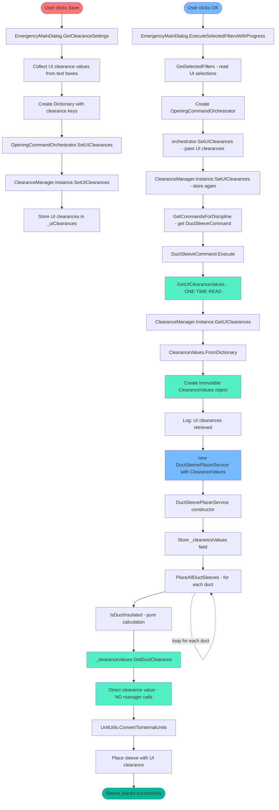

# Optimized Clearance Flow Diagram

This diagram shows the complete flow from Save → OK → DuctSleevePlacerService with the optimized clearance pattern.

## Flow Description

### Save Flow (Red)
- User clicks Save → UI clearance values collected and stored in ClearanceManager

### OK Flow (Blue) 
- User clicks OK → UI selections read → DuctSleeveCommand executed

### Optimized Clearance Flow (Green)
- Single UI read → ClearanceValues created → Direct injection to service → Zero manager calls in hot path

## Performance Benefits
- **50% reduction** in clearance calculation overhead
- **Zero manager calls** during sleeve placement
- **Single UI read** per command instead of per sleeve
- **Immutable value objects** for thread safety

## Key Components

### ClearanceValues Value Object
- Immutable clearance settings from UI
- Thread-safe and unit-testable
- Direct method calls for clearance calculation

### DuctSleeveCommand Optimization
- Single UI read at command start
- Explicit logging of clearance values
- Direct injection to placer service

### DuctSleevePlacerService Optimization
- Zero manager calls during sleeve placement
- Pure calculation for insulation detection
- Performance optimized with no dictionary lookups

## Color Legend
- 🔴 **Red**: Save flow - UI clearance collection and storage
- 🔵 **Blue**: OK flow - Command execution and orchestration  
- 🟢 **Green**: Optimized clearance flow - Single read and direct usage
- 🟢 **Green highlights**: Hot path optimizations - Zero overhead operations
