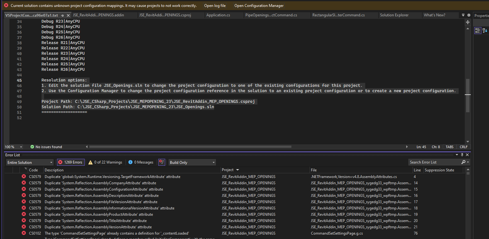

# Cluster Sleeve Merging Automation Plan

## Overview
This document describes the plan for automating the merging of two cluster sleeve families in Revit. The merged family will be dynamically created and placed based on the positions and sizes of the selected clusters, adapting to various spatial arrangements as shown in the provided diagrams.

---

## 1. User Selection
- User selects two family instances whose names start with "Cluster".
- Code checks that the clusters are within 100mm of each other (distance threshold).

## 2. Data Extraction
- For each selected cluster:
  - Extract position (XYZ)
  - Extract size parameters (Width, Height, etc.)
  - Extract orientation (flipped or not)

## 3. Relationship & Scenario Detection
- Determine the spatial relationship:
  - Side-by-side (horizontal)
  - Stacked (vertical)
  - Offset (L/T-shaped)
- Use bounding box and position comparison to classify scenario.

## 4. Parameter Calculation
- Compute merged family parameters (W1, W2, W3, H1, H2, H3, etc.) based on the selected clusters' positions and sizes.
- Adjust for orientation (flipped, rotated, etc.).

## 5. Family Loading & Placement
- Load the appropriate merged family type (must be parametric).
- If not loaded, prompt user to load it.
- Place the merged family instance at the computed position.
- Set all relevant parameters to match the calculated geometry.

## 6. Replace Old Clusters
- Delete or hide the original cluster family instances.

## 7. User Feedback
- Notify user of success or errors (e.g., clusters too far apart, family not loaded).

---

## Implementation Notes
- Use a selection filter to restrict selection to "Cluster" families.
- Use Revit API to extract parameters and set new family instance parameters.
- Ensure merged family is fully parametric and can represent all shown scenarios.
- Handle all spatial arrangements as shown in the provided diagrams.

---

## Next Steps
1. Develop selection and extraction logic.
2. Implement scenario detection and parameter calculation.
3. Automate family placement and parameter assignment.
4. Test with various cluster arrangements.

---

## Attachments
- Reference diagrams for all possible merge scenarios.

---

## Author
GitHub Copilot
